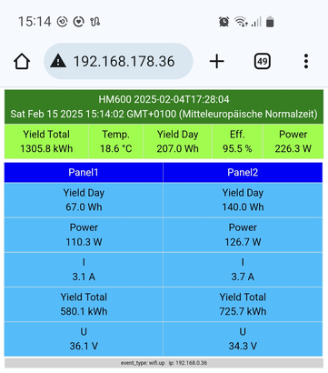
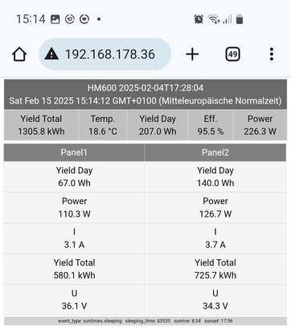
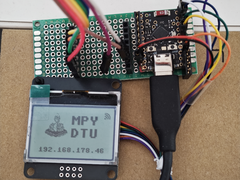
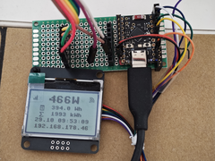

mpy-DTU 
=======================================================================

A simple Micropython DTU for Hoymiles solar inverters. Live data from your inverter is shown on a display and send via MQTT for integration in home automation.


 






It's a fun project for people like me who like hacking with micropython. 

Communicating with Hoymiles Micro-Inverters using Micropython
------------------------

The `hoymiles` package in this directory is an adopted version of Ahoy CPython tools to communicate with Hoymiles micro-inverters [0].
It has been modified, refactored and extended to run on Micropython (tested so far on esp32c3, esp32s2, esp32, rp2350 (pico2 w), esp32c6, wemos w600 (console output only, not enough ram for more!)
It even runs on microcontrollers without wifi support, though it might not be very useful.
I haven't tried esp8266 and do not recommend it because of hardware limitations, thought it might work.
Parts of the code is shared between CPython and Micropython. The code runs on Linux based Raspberry Pi hardware as well but this might change (Tested with Raspberry Pi Zero W so far).
If you want to run this code on a Linux based Raspberry Pi SBC see README.md [1] for hardware setup.

*The following documentation assumes that you are familiar with Micropython and the tools `mpremote` [6] and `mpy-cross` [7]*

Required Hardware Setup
-----------------------
The hardware setup on microcontrollers is the same as with regular Ahoy-DTU. [2]

Required Hardware:

- ESP32x with Micropython (any esp32x is OK e.g. esp32s2, esp32s3, esp32c3, esp32c6). RP2350 W basically worked but nrf communication wasn't good. esp32 and w600 worked only with console output due to lack of ram (unless you use romfs, see instructions below.
- nRF24L01+ Module
- Optional: I2C OLED Display (128x64 ssd1306) or SPI LCD (128x64 st7567)
- Hoymiles HM series solar inverter with panel ;-)
- stable power supply for the microcontroller

Required Python Modules
-----------------------

Some modules are not installed by default on Micropython, therefore you have to add them manually:

```code
mpremote mip install logging
mpremote mip install datetime
```

Dependencies for output plugins:

```code
mpremote mip install umqtt.simple
mpremote mip install umqtt.robust
mpremote mip install ssd1306
mpremote cp micropython-lib/ST7567.mpy :lib/ # optional for ST7567 LCD display
```

An alternative way to install these dependencies is:

```
mpremote mip install github:jkorte-dev/mpy-dtu/micropython-lib/package.json
```


WiFi Setup
----------

You also need some scripts to set up wifi
```code
mpremote mkdir :lib
mpremote cp micropython-lib/wlan.py :lib/
```

Edit your wifi credentials `ssid` and `password` in `micropython-lib/secrets.py`

```code
secrets = {
    'ssid': 'SSID',
    'password': 'PASSWORD',
}
```

and copy the file to your device:

```code
mpremote cp micropython-lib/secrets.py :lib/
```

With older micropython version you may get an import error when importing asyncio module.
```
mpremote cp micropython-lib/asyncio.py :lib/
```

will fix it.


nRF24L01 Driver
---------------

The nRF24L01 driver for inverter communication requires support for `auto acknowledge` and `dynamic payloads`.
Unfortunately the official Micropython driver does not support this features.
Therefore, I included a driver which I ported from CircuitPython to Micropython.
The source of the original CircuitPython driver is [3]. See documentation from Adafruit [4]. The API is unchanged except initialization. 
As the driver (and other code) consumes a lot of memory I recommend installing the driver
`nrf24.py` as a mpy module using the micropython tool `mpy-cross` or use 

```code
 mpremote mip install --index https://raw.githubusercontent.com/jkorte-dev/mpy-dtu/master/nrf24 nrf24
```

Configuration
-------------

Local settings are read from `ahoy_cfg.py`  
An example is provided as `ahoy_cfg.example`
Edit this file to your needs (**inverter serial number is required!**) and copy it to your device.

```code
mpremote cp ahoy_cfg.py :
```


Module Installation
--------------------------

Manual installation using `mpremote`:

```code 
mpremote mkdir hoymiles
mpremote cp hoymiles/__init__.py           :hoymiles/

mpremote mkdir hoymiles/decoders
mpremote cp hoymiles/decoders/__init__.py  :hoymiles/decoders/
mpremote cp hoymiles/decoders/ucrcmod.py   :hoymiles/decoders/

mpremote mkdir hoymiles/uradio/
mpremote cp hoymiles/uradio/__init__.py  :hoymiles/uradio/
mpremote cp hoymiles/uradio/nrf24.py  :hoymiles/uradio/

mpremote cp hoymiles/uoutputs.py           :hoymiles/
mpremote cp hoymiles/dtu.py                :hoymiles/
mpremote cp hoymiles/ulogo.py              :hoymiles/    # optional 
mpremote cp hoymiles/websunsethandler.py   :hoymiles/
mpremote cp hoymiles/usunsethandler.py     :hoymiles/    # usunsethandler.py + sun_moon.py can replace websunsethandler.py 
mpremote cp hoymiles/sun_moon.py           :hoymiles/    # usunsethandler.py + sun_moon.py can replace websunsethandler.py 
mpremote cp hoymiles/uwebserver.py         :hoymiles/
```

Alternative Installation 
-------------------------

The module can also be installed as mip package [8] from the repo with 

```
mpremote mip install --target / github:jkorte-dev/mpy-dtu/package.json
```

Example Run
-----------
Minimal code to communicate with a hoymiles inverter is:

```code 
from hoymiles import HoymilesDTU
import asyncio

ahoy_config = {'interval': 5,
               'transmit_retries': 5,
               'nrf': [{'spi_num': 1, 'cs': 12, 'ce': 16}],  # esp32s2 wemos mini
               'dtu': {'serial': 99978563001, 'name': 'mpy-dtu'},
               'inverters': [
                   {'name': 'HM_XXX',
                    'serial': 114182912345,
                    'strings': [
                        {'s_name': 'Panel_1', 's_maxpower': 380},
                        {'s_name': 'Panel_2', 's_maxpower': 380},
                    ]
                    }
                ]
               }


def result_handler(result, inverter): print(result.to_dict())

dtu = HoymilesDTU(ahoy_cfg=ahoy_config,
                  status_handler=result_handler,
                  info_handler=lambda result, inverter: print("hw_info", result, result.to_dict()))

asyncio.run(dtu.start())
```
Change your SPI/Pin configuration according to your setup and do not forget to change the inverter serial number.

The following command will run a micropython script to poll the inverter and output to the configured outputs (display, mqtt).


```code
mpremote run hoymiles_mpy.py
```

### Web Page
To start a simple webserver serving a page which displays the inverters live data run:

```code
mpremote run hoymiles_exp.py
```

`hoymiles_exp.py` requires a lot of memory. You will need to install parts as mpy modules, at least the nrf24 driver. The script calls
 `gc.connect()` to free some memory.

### Daytime / Nighttime Mode:

If you enable suntimes support in ahoy_cfg.py e.g:

```
'sunset': {'disabled': False, 'latitude': 51.799118, 'longitude': 10.615523, 'altitude': 1142}
```

the inverter will be polled only during daytime of given location and time.
The web page will turn grey and a moon symbol is shown on the display during nighttime.
Default sunset handler is `websunsethandler.py` which requires network connection and consumes a lot of ram.
An experimental alternative is `usunsethandler.py` which needs `sun_moon.py` from Peter Hinch and a small config change (add `'mod': 'usunsethandler'`):

```
'sunset': {'disabled': False, 'latitude': 51.799118, 'longitude': 10.615523, 'altitude': 1142, 'mod': 'usunsethandler'}
```


Once you are happy with `hoymiles_exp.py` or `hoymiles_mpy.py` you can start your mpy dtu on boot by importing one of the scrips in `main.py`.
E.g.

```
import hoymiles_exp
```

Caveats
-------

**This is work in progress and documentation is incomplete.**

I have been running the code on an esp32c6 board for several days/weeks now without any issues, even with the web server enabled.
Important is, as I mentioned before stable power supply. I have enabled the Watchdog timer in `hoymiles_exp.py` to be sure to survive network outages.

If you run out of memory (e.g. you see `OSError: [Errno 12] ENOMEM`) install parts of the hoymiles modules as mpy modules using `mpy-cross`. 
Start with the `nrf24.py` driver and `hoymiles/decoder/__init.py`.
I think esp32s2 is a good choice to start with as it has plenty of ram, esp32c6 works also very well.
Inverter polling is very bad on rp2350, but runs OK on esp32c6.
While spending a lot of time on stability, I discovered that a stable power supply is crucial.
On the USB port the microcontroller stopped operating after some time. Do not use the cheapest power supply,
because bad designed power supplies may interfere with the nrf24l01 module.

*Only Hoymiles HM series supported. The communication with the inverter is readonly*


Running on ESP32 with romfs
----------------------------

I had success running the fully featured version of the dtu on esp32 with micropython 1.26.1. 
This requires a custom build with romfs [9] / [10] support to deploy the ``hoymiles`` module in a romfs partition.
Once you have flashed micropython with romfs support you can try.

1. prepare a directory ``./romfs`` with the following files:

````
romfs/logging.mpy
romfs/ST7567.mpy
romfs/ssd1306.mpy
romfs/datetime.mpy
romfs/crcmod.mpy
romfs/hoymiles
romfs/hoymiles/dtu.py
romfs/hoymiles/ulogo.py
romfs/hoymiles/uoutputs.py
romfs/hoymiles/__init__.py
romfs/hoymiles/uoutputs.py
romfs/hoymiles/uwebserver.py
romfs/hoymiles/decoders
romfs/hoymiles/decoders/__init__.py
romfs/hoymiles/websunsethandler.py
romfs/hoymiles/usunsethandler.py
romfs/hoymiles/sun_moon.py
romfs/hoymiles/uradio
romfs/hoymiles/uradio/__init__.py
romfs/nrf24.mpy
romfs/wlan.mpy
````
2. make image with:

``mpremote romfs --output dtu.romfs build dtu_romfs``

3. deploy the romfs with `mpremote` (latest mpremote with romfs support required):

`` mpremote romfs deploy dtu.romfs`` or skipping step 2 with ``mpremote romfs deploy dtu_romfs``

additionally you need ``ahoy_cfg.py`` (the config file) , ``secrets.py`` for wifi setup and the main script ``hoymiles_mpy.py``

Modifications
-------------

Modification made based on the original work from lumapu ahoy dtu:

- moved all Linux/CPython specific code to `__main__.py`. All shared code to `hoymiles/__init__.py` and `decoders/__init__.py`
- extracted actual DTU code to module dtu.py
- extracted NFR24 communication code to new subpackage radio (Linux/CPython only)
- NRF communication code for Micropython in subpackage uradio including driver ported from CircuitPython (Micropython only)
- extracted sunset handler to module `sunsethandler.py`(Linux/CPython only)
- added `websunsethandler.py` for Micropython because precision of used calculation was not sufficient on Micropython to calculate sunset, later added `usunsethandler.py` which uses sun set/rise calculation from Peter Hinch[11] .
- added `uoutputs.py` for Micropython output plugins (Micropython only)
- added `decoders/ucrcmod.py` minimal crc functions needed. Stripped down from [5] for Micropython (works on CPython as well)
- used asyncio to be able to run webserver in parallel

All files starting with `u` are Micropython specific. `hoymiles/__main__.py` is not needed and will not run on Micropython.

Outputs
-------

Output plugins so far:

- SSD1306 I2C display
- ST7567 SPI display
- MQTT
- Blink LED / WS2812 NeoPixel
- Web GUI

TODOs
------
- make HoymilesNRF.receive() non-blocking
- yield more time for async webserver
- find out why polling inverter is so bad with rp2350
- try async mqtt
- remove logging to reduce size

References
----------

- [0] https://github.com/lumapu/ahoy/blob/main/tools/rpi/hoymiles
- [1] https://github.com/lumapu/ahoy/blob/main/tools/rpi/README.md
- [2] https://github.com/lumapu/ahoy/
- [3] https://github.com/nRF24/CircuitPython_nRF24L01
- [4] https://circuitpython-nrf24l01.readthedocs.io/en/latest/
- [5] https://crcmod.sourceforge.net/intro.html
- [6] https://docs.micropython.org/en/latest/reference/mpremote.html
- [7] https://docs.micropython.org/en/latest/reference/mpyfiles.html
- [8] https://docs.micropython.org/en/latest/reference/packages.html
- [9] https://github.com/micropython/micropython/wiki/Board-profile-configuration-for-RomFS
- [10] https://github.com/orgs/micropython/discussions/17873
- [11] https://github.com/peterhinch/micropython-samples/tree/master/astronomy
