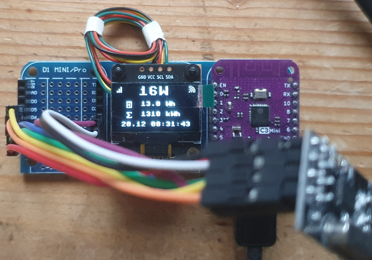

Communicating with Hoymiles Micro-Inverters using Micropython
=======================================================================

The `hoymiles` package in this directory is an adopted version of Ahoy CPython tools to communicate with Hoymiles micro-inverters [0].
It has been modified, refactored and extended to run on Micropython (tested so far on esp32c3, esp32s2, esp32, rp2350 (pico2 w))
It even runs on microcontrollers without wifi support, though it might not be very useful.
I haven't tried esp8266 and do not recommend it because of hardware limitations, thought it might work.
Parts of the code is shared between CPython and Micropython. The code runs on Linux based Raspberry Pi hardware as well but this might change (Tested with Raspberry Pi Zero W so far).

*The following documentation assumes that you are familiar with Micropython and it's tools `mpremote` [6] and `mpy-cross` [7]*

Required Hardware Setup
-----------------------

The hardware setup on microcontrollers is the same as with regular Ahoy-DTU. [2]
See README.md [1] for hardware setup on Raspberry Pi



Required python modules
-----------------------

Some modules are not installed by default on Micropython, therefore you have to add them manually:

```code
mpremote mip install logging
mpremote mip install datetime
```

Dependencies for output plugins:

```code
mpremote mip install umqtt.robust
mpremote mip install ssd1306
```

WIFI setup
----------

You also need some scripts to setup wifi
```code
mpremote mkdir :lib
mpremote cp micropython-lib/wlan.py :lib/
```

Edit your wifi credentials `ssid` and `password` in `micropython-lib/secrets.py` and copy the file to your device:

```code
mpremote cp micropython-lib/secrets.py :lib/
```

nRF24L01 Driver
---------------

The nRF24L01 driver for the inverter communication needs support for `auto acknowledge` and `dynamic payloads`.
Unfortunately the official Micropython driver does not support this features.
Therefore, I included a driver which I ported from CircuitPython to Micropython.
The source of this driver is [3]. See documentation from Adafruit [4]. The API is unchanged except initialization. 
As the driver (and other code) consumes a lot of memory I recommend installing the driver
`nrf24_mp.py` as a mpy module using the micropython tool `mpy-cross`.

Configuration
-------------

Local settings are read from `ahoy_cfg.py`  
An example is provided as `ahoy_cfg.example`
Edit this file to your needs (**inverter serial number is required!**) and copy it to your device.

```code
mpremote cp ahoy_cfg.py :
```


Module Installation
--------------------------

```code 
mpremote mkdir hoymiles
mpremote cp hoymiles/__init__.py           :hoymiles/

mpremote mkdir hoymiles/decoders
mpremote cp hoymiles/decoders/__init__.py  :hoymiles/decoders/
mpremote cp hoymiles/decoders/ucrcmod.py   :hoymiles/decoders/

mpremote mkdir hoymiles/nrf24mpy
mpremote cp hoymiles/nrf24mpy/__init__.py  :hoymiles/nrf24mpy/
mpremote cp hoymiles/nrf24mpy/nrf24_mp.py  :hoymiles/nrf24mpy/

mpremote cp hoymiles/uoutputs.py           :hoymiles/
mpremote cp hoymiles/websunsethandler.py   :hoymiles/
mpremote cp hoymiles/uwebserver.py         :hoymiles/
```

Alternative installation 
-------------------------

The module can also be installed as local mip package with 

```
python3 -m http.server
mpremote mip install --target / http://localhost:8000/package.json
```

Example Run
-----------
Minimal code to communicate with a hoymiles inverter is:

```code 
from hoymiles import HoymilesDTU
import asyncio

ahoy_config = {'interval': 5,
               'transmit_retries': 5,
               'nrf': [{'spi_num': 1, 'cs': 12, 'ce': 16}],  # esp32s2 wemos mini
               'dtu': {'serial': 99978563001, 'name': 'mpy-dtu'},
               'inverters': [
                   {'name': 'HM_XXX',
                    'serial': 114182912345,
                    'strings': [
                        {'s_name': 'Panel_1', 's_maxpower': 380},
                        {'s_name': 'Panel_2', 's_maxpower': 380},
                    ]
                    }
                ]
               }


def result_handler(result, inverter): print(result.to_dict())

dtu = HoymilesDTU(ahoy_cfg=ahoy_config,
                  status_handler=result_handler,
                  info_handler=lambda result, inverter: print("hw_info", result, result.to_dict()))

asyncio.run(dtu.start())
```
Change your SPI and Pin configuration according to your setup.

The following command will run a micropython script to poll the inverter and output to the configured outputs (display, mqtt).


```code
mpremote run hoymiles_mpy.py
```

or even more experimental than above with ugly minimalistic web interface  (pico 2 W only):

```code
mpremote run hoymiles_exp.py
```

Caveats
-------

**This is work in progress. In this stage it is more or less a proof of concept and not stable at all, not even thoroughly tested.
Be prepared for crashes and incomplete documentation.**

If you run out of memory install parts of the hoymiles modules as mpy modules using `mpy-cross`. I think esp32s2 is a good choice to start with.
Inverter polling is very bad on rp2350 :-(

*Only Hoymiles HM series supported.*


Modifications
-------------

- moved all Linux/CPython specific code to `__main__.py` all shared code to `hoymiles/__init__.py` and `decoders/__init__.py`
- extracted NFR24 communication code to new subpackage nrf24 (Linux/CPython only)
- NRF communication code for Micropython in subpackage nrf24mpy including driver ported from Circuitpython (Micropython only)
- extracted sunset handler to module `sunsethandler.py`(Linux/CPython only)
- added `websunsethandler.py` for Micropython because precision is not sufficient on Micropython to calculate sunset
- added `uoutputs.py` for Micropython output plugins (Micropython only)
- added `decoders/ucrcmod.py` minimal crc functions needed. Stripped down from [5] for Micropython (works on CPython as well)
- used asyncio to be able to run webserver in parallel

All files starting with `u` are Micropython specific. `hoymiles/__main__.py` is not needed and will not run on Micropython.

Outputs
-------

Output plugins so far:

- SSD1306 I2C display 
- MQTT
- Blink LED

TODOs
------
- make HoymilesNRF.receive() non-blocking
- yield more time for async webserver
- find out why polling inverter is so bad with rp2350

References
----------

- [0] https://github.com/lumapu/ahoy/blob/main/tools/rpi/hoymiles
- [1] https://github.com/lumapu/ahoy/blob/main/tools/rpi/README.md
- [2] https://github.com/lumapu/ahoy/
- [3] https://github.com/nRF24/CircuitPython_nRF24L01
- [4] https://circuitpython-nrf24l01.readthedocs.io/en/latest/
- [5] https://crcmod.sourceforge.net/intro.html
- [6] https://docs.micropython.org/en/latest/reference/mpremote.html
- [7] https://docs.micropython.org/en/latest/reference/mpyfiles.html
